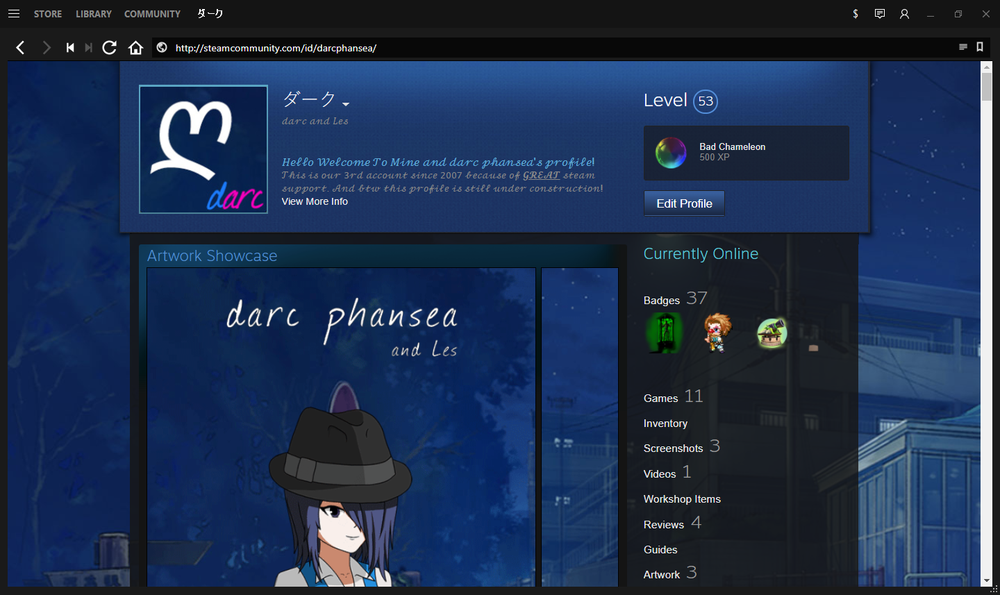

# Enhanced Steam Standalone Unofficial
> Steam Client gets Enhanced

Enhanced Steam Standalone Unofficial is a shell made by [darc phansea](http://steamcommunity.com/profiles/76561198373212815) for the [Enhanced Steam](https://github.com/jshackles/Enhanced_Steam) browser extension 

## Pre-Installation

1. This uses .NET Framework 4.6.1 so yeah install that.

## Installation

1. Run Setup.exe
2. Profit

## Contribute

If you find ways to code a certain part better please send me the original piece of code as well as the improved version.
If you have additions you've coded that you wish to see in this version please send me a copy.
Suggestions? All of this can be done if you contact me on steam - http://steamcommunity.com/profiles/76561198373212815

## License

Enhanced Steam Standalone Unofficial is Copyright 2018 Nicholas Santiago.  This program is free software: you can redistribute it and/or modify it under the terms of the GNU General Public License v3 or newer as published by the Free Software Foundation.  A copy of the GNU General Public License v3 can be found in [LICENSE](LICENSE) or at https://www.gnu.org/licenses/gpl-3.0.html.
